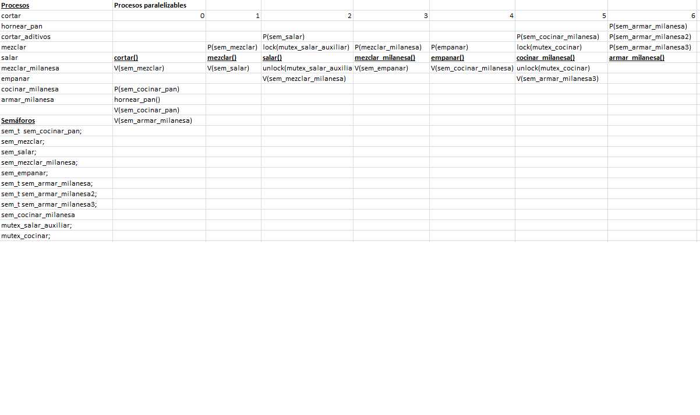
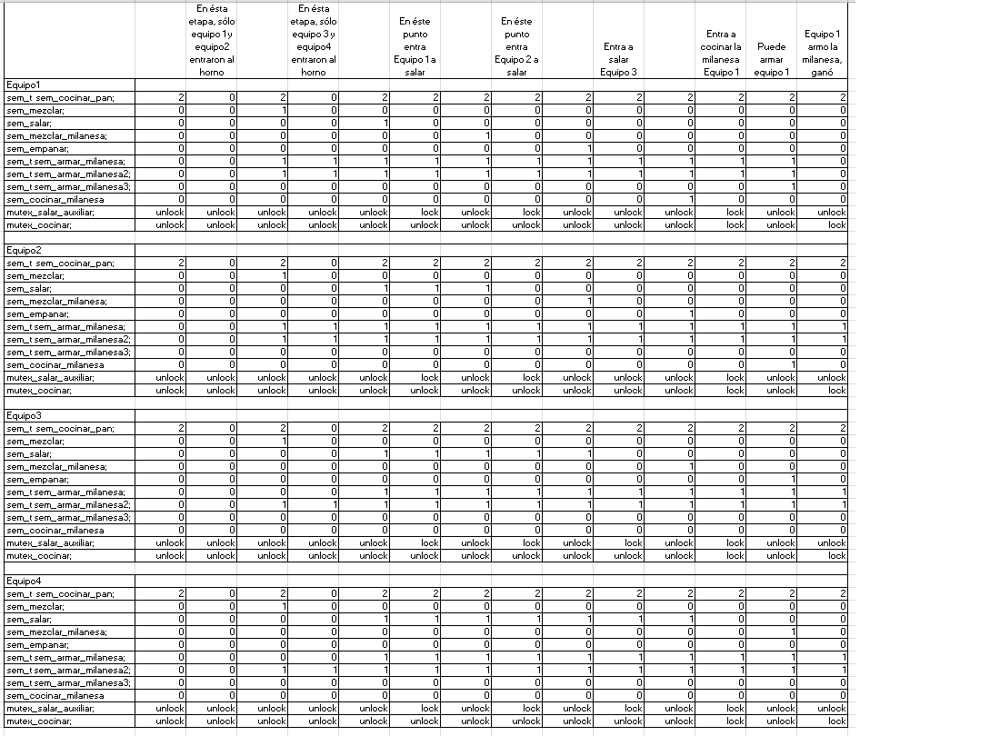

# SOR-Semáforos-1S-2021
## Trabajo Práctico Semáforos primer semestre año 2021
## Alumno : Espinillo Elías
### INTRODUCCIÓN
En éste trabajo, se buscó la resolución de una competencia de cocina en base a la programación, aplicaciones del lenguaje C y utilización de semáforos. Se vieron principalmente la aplicación de éstos ultimos y su aplicación apra poder resolver problemas de recursos compartidos, como en éste caso fue el horno, un salero y una cocina para poder realizar la comida. 

### PROCESO DE CREACIÓN DEL SISTEMA
En primera instancia, compile y ejecute el template brindado para ver su comportamiento y la salida que tenía, para poder empezar a ver lo que se podía requerir y ver el funcionamiento de las funciones dadas.

Una vez visto ésto, se empezó a realizar un pseudocodigo con los procesos que serían necesarios y los posibles semáforos que se necesitarían, de acuerdo a lo solicitado en el trabajo práctico.

A continuación, adjunto una imagen con el pseudocodigo:

Una vez realizado, empecé a utilizar la función que dieron de base (cortar) para poder empezar a replicarlo en las demás que tenían que aplicarse en el programa, que son:
- *mezclar*
- *salar*
- *mezclar_milanesa*
- *empanar*
- *cocinar_milanesa*
- *cortar_aditivos*
- *cocinar_pan*
- *armarMilanesa*
 
De todas formas, en al principio, sólo se probó con:

- *mezclar*
- *salar*
- *mezclar_milanesa*
- *empanar*
- *cocinar_milanesa*
- *cortar_aditivos*

Las mismas primeramente fueron aplicadas a 1 sólo hilo, y de forma progresiva,  para asegurarme que fueran bien ejecutadas y su formato base estuviese bien hecho. 
Esto conllevó a la creación de sus respectivos semáforos, para poder concatenar las habilitaciones necesarias. 

Viendo que ésto funcionaba correctamente, comencé a agregar 1 hilo más, probando las funciones que requerían de 1 exclusión mutua, como el caso del salero y de la sarten. 
Para ésto, empece a aplicar semaforos mutex, que bloquean el acceso a los recursos compartidos, bloquendo la sección critica para que un sólo hilo pueda trabajar sobre la misma, para luego dejarle a los demás. Los primeros mutex aplicados fueron:

- *mutex_salar_auxiliar*
- *mutex_cocinar*

El primer problema que tuve en éste caso, fue de colocación de los semáforos, ya que los mismos debían ser compartidos e inicializados fuera del struct, pero en primera instancia los coloqué dentro del struct de semáforos, no logrando que funcionara correctamente. 
Una vez buscada la información sobre el funcionamiento de éstos y dónde debían ser inicializados y declarados, se vio el correcto funcionamiento.

Con ésta información, se procedió a agregar 1 hilo más y a hacer funcionar el proceso cocinarPan, haciendolo funcionar con un semáforo inicializado en 2, permitiendo el ingreso de sólo 2 threads. 

Observando que en ésta instancia todo funcionaba correctamente, se procedió a agregar semáforos auxiliares y a probar la función armarMilanesa. De esa forma, a las funciones 

- *cortarAditivos*
- *cocinarPan*
- *cocinar_milanesa*

Se les agregó un semáforo que, una vez se encuentren los 3 con valor 1, daría paso a permitir que se armase la milanesa. 

Se agregó también un mutex que provoca el bloqueo de la función una vez que un proceso entra a *armarMilanesa*, para que haya un sólo ganador. 

Viendo que todo ésto funcionaba, se procedió a exportar los datos a un TXT. Para ésto, se modificó la función dada imprimirAccion, haciendo que cada vez que se generaba una acción, guarde la misma en el archivo "salida.txt". 
Para abrir el archivo se usó fopen y para guardar archivos dentro se uso fprintf.
También se agregó a la función armarMilanesa el hecho de imprimir quién fue el ganador, identificandolo por el número de equipo y guardando éstos mismos datos en el archivo **"salida.txt".**

Una de las partes más complicadas del trabajo práctico fue el tener que realizar la lectura de la receta desde un archivo .txt.

Esto se debió a la poca práctica y conocimiento que manejaba al momento de realizar el trabajo práctico sobre C. Al realizar una investigación a través de internet y del libro recomendado para la materia, se pudo realizar la función cargarReceta, trabajando con strtok para poder separar mediante "|" las palabras, para poder identificar las acciones de los ingredientes. 

Se pasó a probar primero con un sólo hilo, para chequear que cargasue correctamente, y luego se pasó a aplicar a todos los hilos. 

En ése momento, nuestro sistema quedó completo. 

### CONCLUSIÓN
A modo de conclusión, pude aprender sobre la aplicación de semáforos y su funcionamiento. La aplicación de los mismos no fue lo más dificil del sistema, dado que pude apoyarme en un pseudocodigo y su prueba de campo, sino que lo más dificil fue el poco conocimiento sobre el lenguaje C. Se pudieron aplicar conocimientos anteriores de programación, identificancdo estructuras y métodos de programación comunes, lo cual facilitó, por ejemplo, la programación de los semáforos. 
Lo que más trabajo llevó fue la función para leer de un archivo, dado quese tuvo que emplear la mayor parte del tiempo de investigación, por las diferencias de sintaxis y aplicaciones especificas que se tenía para poder aplicar al mismo. 

Fuentes:
https://www.tutorialspoint.com/c_standard_library/c_function_strtok.htm
https://www.youtube.com/watch?v=faZEhIHdJx8
https://www.youtube.com/watch?v=YC61729PThw
https://parzibyte.me/blog/2018/11/13/separar-cadena-delimitadores-c-strtok/
Presentaciones realizadas en clases
https://docs.google.com/presentation/d/14JAVhH1onaNw-DWdeDjgFCKWeTI2B2a15u19wIQfzXg/edit#slide=id.p22
